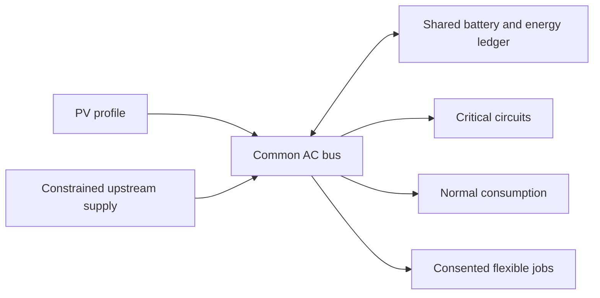
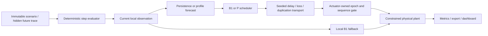
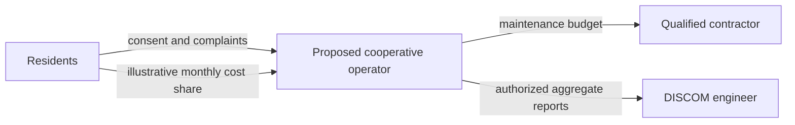

# GridSathi architecture

The implemented reliability model is a deterministic single-process simulator. Power is kW, energy is kWh and the default interval is five minutes. This is an aggregate AC bus behind a common connection point. Network losses default to zero. No controller, communications node or backup label creates energy.

## Implemented interfaces

- `src/domain/__init__.py`: frozen, extra-field-forbidding Pydantic assets, tasks, faults, scenario, observation, forecast and dispatch contracts. Units are part of field names; timezone-aware start and equal-length finite traces are required.
- `src/domain/plant.py`: clips commands against available power and physical SOC. Critical loads precede normal loads and earliest-deadline tasks. Accepted power is recorded separately from requested power. Every step asserts a bus residual below 1e-7 kW.
- `src/scenarios`: independent seeded synthetic physical inputs. A controller is never passed a `Scenario` object or future realized input arrays.
- `src/forecasting`: a 36-step/3-hour forecast, recomputed from current information. Persistence and public time-of-day templates are compared. Uncertainty bands are assumed envelopes, not calibrated confidence intervals.
- `src/control`: B0 (different assets), competent B1 and forecast heuristic P. This release deliberately uses the plan's lightweight heuristic option; it has no MILP solver, solve-status claim or optimality claim.
- `src/coordination`: independent seeded transport and a single simulated actuator-owned authority. Commands are checked before simulated actuation.
- `src/evaluation/runner.py`: `Runner.step()`, `Runner.run()`, `Runner.export()`, `compare()`. Outputs include scenario, manifest, tasks, events, metrics and interval records. Command failures apply local fallback.
- `src/api.py`: local run and comparison service; consistent serialized copies under a lock. Twelve isolated active runs and twelve cached comparisons bound memory. Comparison computation is synchronous; an API worker executes it off the event loop. A process restart loses session objects; exports are the durable record.

## Authority and clocks

Ten abstract protocol rounds execute before each energy step. They do not represent seconds. The simulated actuator detects a missing heartbeat after a configurable timeout (default three rounds since last heartbeat), grants a new monotonically increasing epoch and rejects old, duplicate, reordered or expired commands. A replacement uses current energy and task telemetry, never restoring a stale energy ledger. Actual failure-onset-to-detection and detection-to-accepted-command rounds appear in events and metrics.

Transport models random bounded delay, packet loss, duplication and resulting reordering. A partition blocks remote dispatch and local fallback takes over. This deliberately centralized actuator boundary provides no distributed-quorum or multi-actuator safety proof. Short recovery within the ten rounds need not change a five-minute energy result; no fine-grained outage impact is inferred.

The dashboard and evaluator use the same deterministic runner.
